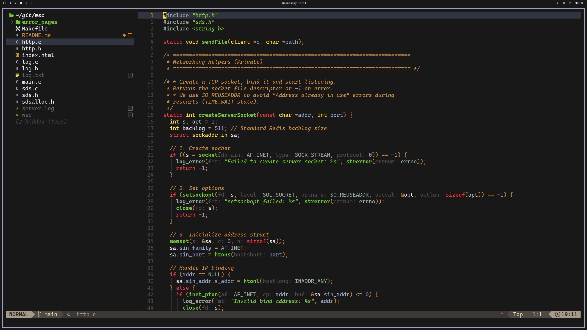

# Gruber Tsoding - Omarchy Theme



A zen, minimal, and distraction-free theme for Omarchy, inspired by the legendary YouTuber [Tsoding](https://www.youtube.com/@Tsoding).

This theme, based on the classic "Gruber Darker" palette, is designed for those who want to focus purely on their code, eliminating all unnecessary visual noise. Embrace the zen of coding.

## Installation

Run the following command to install the theme directly from GitHub:

```sh
omarchy-theme-install https://github.com/davide-ferrara/omarchy-gruberdark-tsoding-theme
```

This will automatically place the theme in your Omarchy themes directory.
