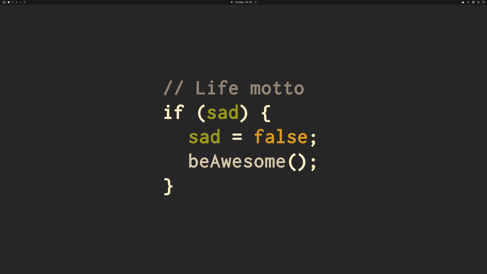

# Gruber Tsoding

> A Gruber Darker-inspired Omarchy theme with a little Tsoding energy — updated for Omarchy Quattro.



Deep charcoal surfaces, warm amber highlights, vivid terminal-green, and muted
Niagara blues: a focused coding palette that stays easy on the eyes. This
release is updated for **Omarchy Quattro** and uses its semantic colour roles.

## What’s included

- Omarchy Quattro colour roles in [`colors.toml`](colors.toml)
- A matching Gruvbox/Gruber Darker Neovim configuration in [`neovim.lua`](neovim.lua)
- btop colours in [`btop.theme`](btop.theme)
- Four hand-picked backgrounds in [`backgrounds/`](backgrounds/)

## Install

Clone the theme into your local Omarchy themes directory, then apply it:

```bash
git clone https://github.com/davide-ferrara/omarchy-gruberdark-tsoding-theme.git ~/.config/omarchy/themes/gruber-tsoding
omarchy theme set gruber-tsoding
```

If the theme is already here, just run:

```bash
omarchy theme set gruber-tsoding
```

## Preview

`preview.png` is the same desktop screenshot shown above, ready for Omarchy’s
theme picker.

## Palette

| Role | Colour |
| --- | --- |
| Background | `#181818` |
| Foreground | `#e4e4ef` |
| Amber accent | `#c9ab25` |
| Green | `#73c936` |
| Blue | `#96a6c8` |
| Red | `#c73c3f` |

---

Built for [Omarchy](https://omarchy.org/).
